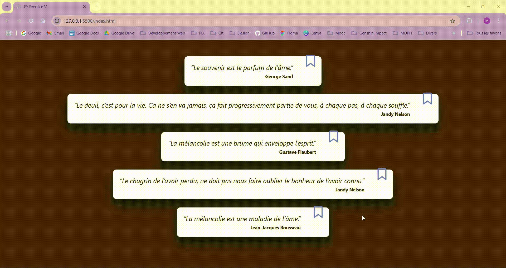

# JavaScript : Exercice V 💻 #
## - Afficher des citations depuis un fichier JS - ##

 

### Objectifs : ###
***Afficher des citations depuis un fichier JS.***

→ Pour cela il faudra : 
      <ul><ul>
        <li>créer un fichier quotes.js dans lequel instancier un tableau associatif</li>
        <li>créer un fichier JS parcourant les citations afin de les afficher</li>
        <li>rajouter un système de favoris</li>
        <li>BONUS (à voir avec le formateur) : stocker les favoris dans le localStorage (se documenter dessus).</li>
      </ul></ul>
 

### ⚙️ Langages utilisés ⚙️ ###

 

### Preview : ###
</img>

 

*Note : exercice fourni par <a href="https://elan-formation.fr/accueil">Elan Formation</a>*